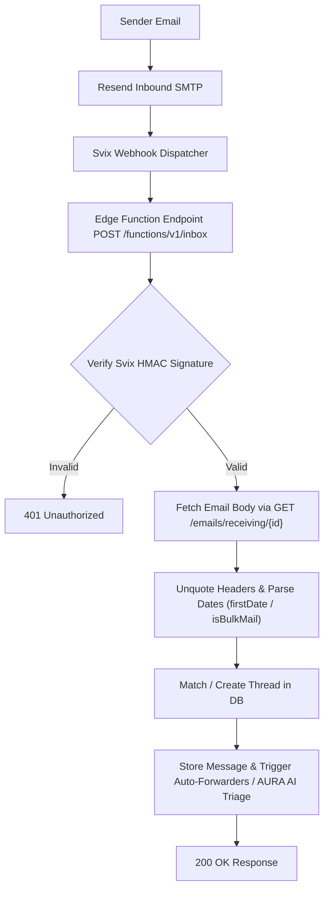

# Inbound Webhook & Engine Architecture

This document describes the inbound email ingestion pipeline, Svix webhook signature verification, Resend API fetch-back logic, header parsing, and backfill replay mechanisms.

---

## 1. Webhook Lifecycle & Pipeline



---

## 2. Ingest Rules & Gotchas

1. **2xx Response Required**:
   - Svix does **not** follow HTTP redirects (301, 302, 308). The webhook endpoint must answer `2xx` directly.
2. **Metadata Payload & Fetch-back Pattern**:
   - Inbound webhook payloads contain metadata only (subject, sender, recipient, message ID).
   - Full HTML/Text bodies and attachment details MUST be fetched from Resend via:
     `GET https://api.resend.com/emails/receiving/{email_id}`
3. **JSON-Encoded Header Parsing**:
   - Resend header strings arrive double-quoted (e.g. `"2026-08-04T20:54:00.000Z"`).
   - Use helper sanitizers `firstDate()` to safely unquote and parse timestamps.
   - Use `isBulkMail()` to unnest `List-Unsubscribe` headers.
4. **Idempotent Ingestion**:
   - Insertion into `inbox_messages` uses unique constraints on `(address_id, message_id)`.
   - Re-running webhooks or backfilling missed mail will never produce duplicate records.

---

## 3. Backfill Command (Replaying Missed Mail)

Resend retains received emails. If the edge function was temporarily offline, missed mail can be backfilled using the admin API:

```bash
curl -X POST -H "Authorization: Bearer <admin-user-jwt>" \
  -H "Content-Type: application/json" \
  -d '{"action": "backfill", "domain_id": "<domain-uuid>"}' \
  "http://localhost:54321/functions/v1/inbox"
```
